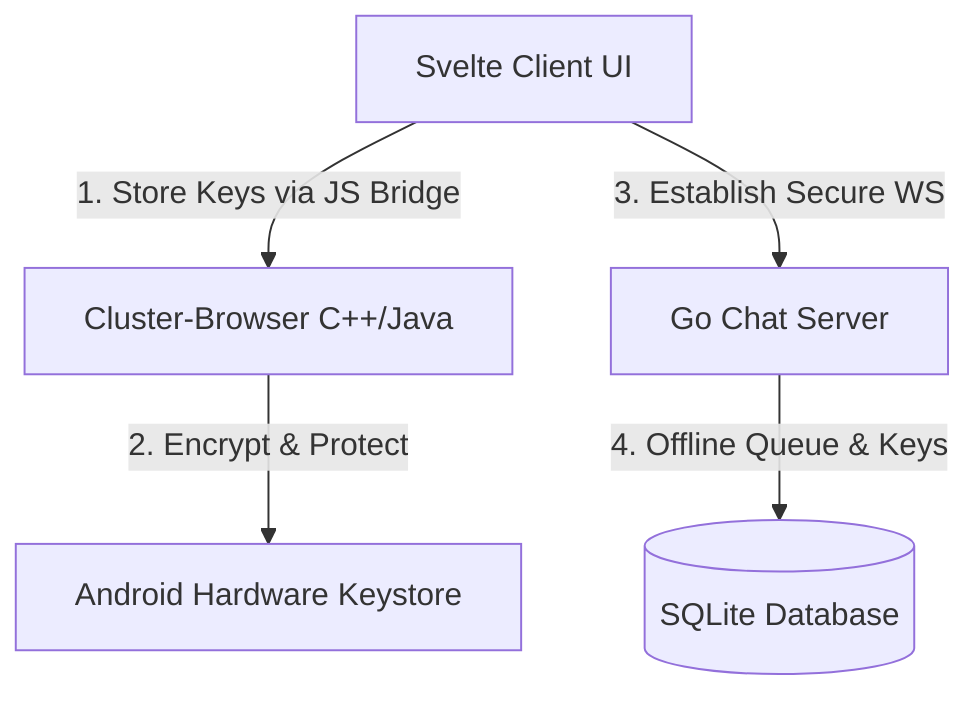

# Cl-Chat Architecture & Integration Plan: Hybrid C++ Browser & Svelte Web App

This document outlines the architecture and execution steps for rebuilding **Cl-chat** as a highly secure, high-performance E2EE application within the **Cluster-Browser** ecosystem. By leveraging our control over the browser's C++ source code, we can achieve native application security (like Signal/WhatsApp) while maintaining a lightweight web-based interface.

---

## 1. Architectural Blueprint

Instead of running a standard isolated web app, we split the responsibilities:
1. **User Interface**: A lightweight **Vite + Svelte** Single Page Application (SPA) loading instantly in the browser's overlay.
2. **Security & Cryptographic Core**: A C++ and Java bridge (`JavascriptInterface` / Mojo) exposed by **Cluster-Browser** directly to the chat web app, bridging key operations to Android's secure hardware.

---

## 2. Browser C++ Integration (The Security Advantages)

Standard web browsers cannot access native hardware features. Because we own the source code of **Cluster-Browser (C++)**, we will implement the following native bridges:

### A. Hardware-Backed Private Key Storage (`Android Keystore`)
* **Mechanism**: When keys are derived on login, the Svelte client will pass the private key to a custom Javascript Interface registered on Chromium's native code:
  `window.clusterBrowser.storePrivateKey(privateKey)`
* **C++ / Java Implementation**: The browser receives the key and uses Android's **Hardware-Backed Keystore System** to encrypt and save it. The key remains inside the device's Trusted Execution Environment (TEE).
* **Benefit**: Protects the E2E private key against local file system inspection and Cross-Site Scripting (XSS) attacks.

### B. Custom Protocol Scheme Handler (`cl-chat://`)
* **Mechanism**: Register a custom protocol scheme `cl-chat://` within Chromium's C++ scheme registry.
* **Benefit**: The chat frontend files can be loaded locally from the browser's assets partition (`cl-chat://index.html`) rather than fetching them over HTTPS. This completely eliminates the threat of DNS hijacking, middleman attacks, or server code tampering.

---

## 3. Frontend Technology: Vite + Svelte

We select **Vite + Svelte** over Jekyll or Astro for the client app:
* **Micro-Bundle Size**: Svelte compiles down to minimal, framework-less JavaScript. The final build loads in milliseconds within the Android sliding overlay.
* **True Reactivity**: Handles real-time WebSocket messaging state (connection status, message queues, presence states) with clean, minimal code.
* **Vite Tooling**: Supports modern ES6 modules, CSS pre-processors, and fast hot module reloading (HMR) for development.

---

## 4. Server Technology: Go + SQLite

Rebuild `cl-chat-server` to support offline delivery guarantees:
* **Offline Storage**: Save encrypted payloads (`ciphertext`, `nonce`, `signature`) in a local SQLite database (`chat.db`) when a recipient is offline.
* **Delivery ACK Loop**: Establish a client-to-server-to-client handshake. Messages are only purged from the server's database once the recipient client verifies receipt and returns an ACK.
* **Offline Key Lookup**: Store public identity keys on the server database so users can start conversations and encrypt messages for offline contacts.

---

## 5. Development Roadmap

| Step | Component | Description |
| :--- | :--- | :--- |
| **1** | Rebuild UI | Scaffold Vite + Svelte app inside `/home/alamgir-zk/Cluster-Family/cl-chat/` |
| **2** | Native JS Bridge | Expose native Java/C++ bridge in `ChatOverlay.java` for hardware Keystore access |
| **3** | Server Upgrade | Update Go server with SQLite storage and a message delivery ACK queue |
| **4** | Custom Protocol | Register `cl-chat://` scheme handler in Chromium's C++ code |
| **5** | Deploy & Build | Compile client, build `chrome_public_apk`, and deploy via `adb` |
